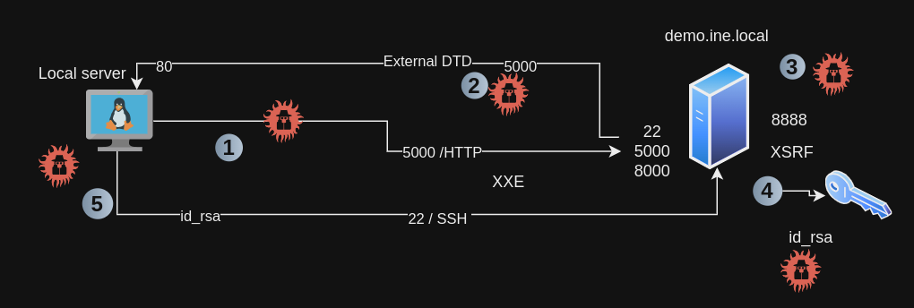
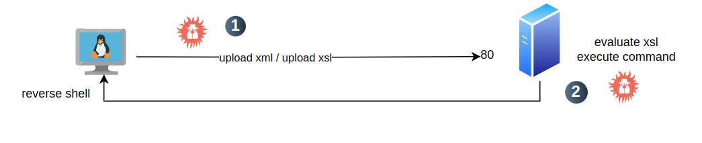

# Server Side Attacks

## Teoría


## Laboratorios

Enunciado de los laboratorios:

```
In this lab, you will leverage XXE vulnerability in a vulnerable application to perform SSRF and eventually gain RCE on the target machine.


Lab Environment
In this lab environment, the user will get access to a Kali GUI instance. A vulnerable web app can be accessed using the tools installed on Kali at http://demo.ine.local.
Objective: Leverage the XXE vulnerability in the web application to perform SSRF, steal SSH keys for a user, and get all the flags from the target machine.


Instructions
The vulnerable application can be accessed via the browser on port 5000.

Tools
The best tools for this lab are:
• Nmap
• ssh
• A web browser

Please go ahead ONLY if you have COMPLETED the lab or you are stuck! Checking the solutions before actually trying the concepts and techniques you studied in the course will dramatically reduce the benefits of a hands-on lab!
```

### SSRF to RCE




Solución al laboratorio:

[SSRF to RCE](./ssrf_to_rce.html)


### XSLT to Code Execution



Solución al laboratorio:

[XSLT to Code Execution](./xslt_to_code_execution.html)


[back](./)

